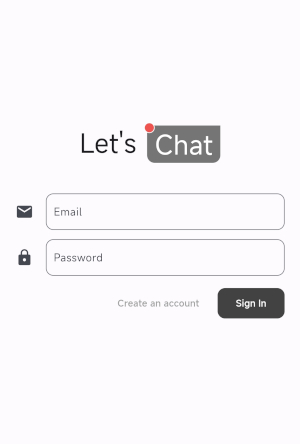
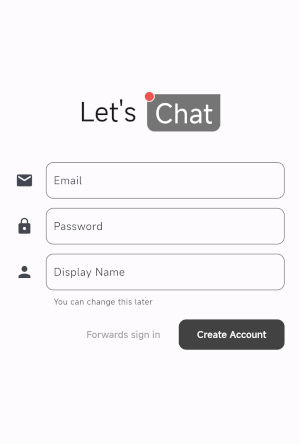
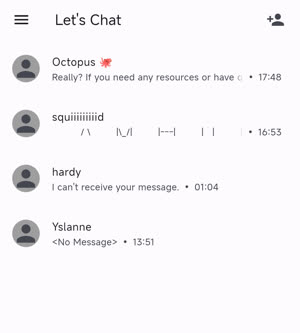
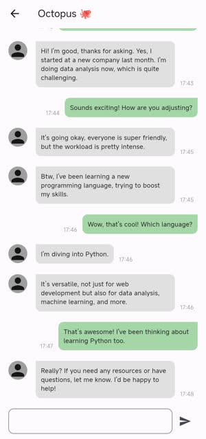
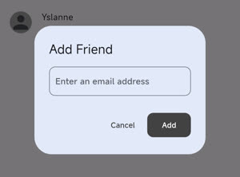
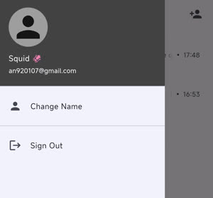
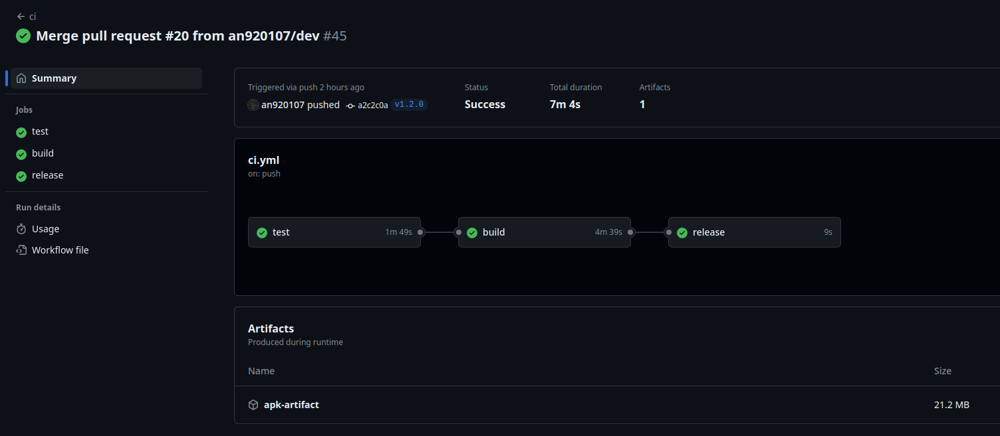

# Let's Chat

 


## Description

A simple chat app for the assignment of Line intern.

## Preview

### Sign In and Registration

 

### Chat Room List



### Chat Room



### Add Friend



### Drawer



## Feature

- Chat rooms and history are based on account.

  - The first-time users can create an account by email, password, and a display name.

  - Users can create chat rooms by searching for others' email.

- The data are stored in Firebase.

  > There are security rules set up for Firestore, so [`firebase_options.dart`](lib/firebase_options.dart) being public is okay.

  - Chat history can be restored at any device.

- Offline chat history.

  - Because the data is also stored in local database, the user can still access the chat history although there is no network.

## Development

- After cloning the repository, you have to do the following steps first:

  1. Resolve the flutter dependencies.

     ```bash
     flutter pub get
     ```

  2. Build the testing dependencies.

     ```bash
     dart run build_runner build
     ```

  3. Copy [`.env.example`](.env.example) as `.env`, and append OpenAI secret key to it.

- There is a workflow (CI) set up for this repository.

  

  - When a **pull requests opened**, it will run `flutter analyse` to check the basic coding rules and `flutter test` to run the tests.

  - When a **tag pushed**, it will run checks mentioned before, and then build the apk file and release it.

- There are several unit tests and widget tests for this repository.

- The design pattern is **MVVM**.
